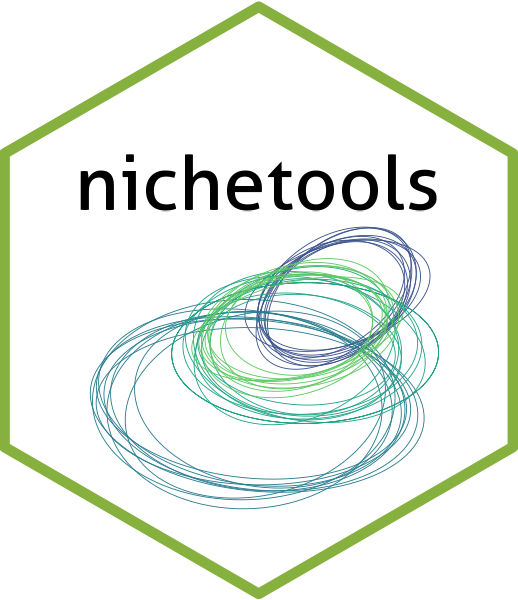

<!-- README.md is generated from README.Rmd. Please edit that file -->

# nichetools <a href="https://benjaminhlina.github.io/nichetools/"> </a>

<!-- badges: start -->

[](https://lifecycle.r-lib.org/articles/stages.html#stable)
[](https://CRAN.R-project.org/package=nichetools)
[](https://benjaminhlina.r-universe.dev/nichetools)
[](https://github.com/benjaminhlina/nichetools/actions/workflows/R-CMD-check.yaml)
[](https://app.codecov.io/gh/benjaminhlina/nichetools)
<!-- badges: end -->

[{nichetools}](https://benjaminhlina.github.io/nichetools/) is a
complementary package to
[{nicheROVER}](https://cran.r-project.org/package=nicheROVER) and
[{SIBER}](https://cran.r-project.org/package=SIBER) that allows the user
to extract Bayesian estimates from data objects created by
[{nicheROVER}](https://cran.r-project.org/package=nicheROVER) or
[{SIBER}](https://cran.r-project.org/package=SIBER)(e.g., niche size and
similarities).

## Installation

You can install the development version of {nichetools} using the
following:

``` r
install.packages("devtools")
devtools::install_github("benjaminhlina/nichetools")
```

You can install the r-universe version of {nichetools} using the
following:

``` r
install.packages("nichetools", 
                 repos = c("https://benjaminhlina.r-universe.dev", 
                           "https://cran.r-project.org"))
```

You can install the CRAN version of {nichetools} using the following:

``` r
install.packages("nichetools")
```

## Vignette

Once you have loaded {nichetools} and {nicheROVER} or {SIBER} you can
access the vignettes using the following code:

``` r
vignette("using-nichetools-with-the-package-nicheROVER")
```

OR

``` r
vignette("using-nichetools-with-the-package-SIBER")
```

You can also use the following to see both vignettes:

``` r
browseVignettes("nichetools")
```

The vignettes are also available online under the articles section of
the website. See the following links, [how to use {nichetools} with
nicheROVER](https://benjaminhlina.github.io/nichetools/articles/) and
[how to use {nichetools} with
SIBER](https://benjaminhlina.github.io/nichetools/articles/using-nichetools-with-the-package-SIBER.html)
or on my [blog](https://blog.benjaminhlina.com/).

I highly suggest going through the vignettes as they will walk you
through how to use {nichetools} in tandem with {nicheROVER} or {SIBER}.

## Citation

To cite this package please cite the following publications

- Swanson, H.K., Lysy, M., Power, M., Stasko, A.D., Johnson, J.D., and
  Reist, J.D. 2015. A new probabilistic method for quantifying
  n-dimensional ecological niches and niche overlap. Ecology 96(2):
  318–324.
  [doi:10.1890/14-0235.1](https://esajournals.onlinelibrary.wiley.com/doi/full/10.1890/14-0235.1)

- Jackson, A.L., Inger, R., Parnell, A.C., and Bearhop, S. 2011.
  Comparing isotopic niche widths among and within communities: SIBER –
  Stable Isotope Bayesian Ellipses in R. Journal of Animal Ecology
  80(3): 595–602.
  [doi:10.1111/j.1365-2656.2011.01806.x.](https://besjournals.onlinelibrary.wiley.com/doi/full/10.1111/j.1365-2656.2011.01806.x)

- Layman, C.A., Arrington, D.A., Montaña, C.G., and Post, D.M. 2007. Can
  stable isotope ratios provide for community-wide measures of trophic
  structure? Ecology 88(1): 42–48.
  [link](https://doi.org/10.1890/0012-9658(2007)88%5B42:CSIRPF%5D2.0.CO;2)

- Hlina B.L. 2024. nichetools: Complementary package to nicheROVER and
  SIBER. R package version 0.3.1.
  <https://benjaminhlina.github.io/nichetools/>
